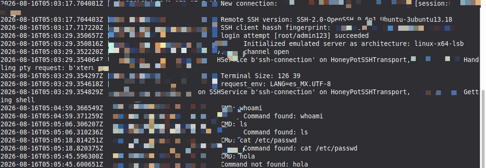

# SSH Honeypot with Docker (Cowrie)

Small hands-on experiment: running a real SSH/Telnet honeypot inside a
Docker container, on an isolated local environment, to see firsthand what
an attacker's session looks like from the defender's side.

## What is a honeypot

A honeypot is a system deliberately exposed to look vulnerable, designed
to attract attackers so their behavior can be observed and logged, without
any real risk to production systems. It's a common tool in defensive
security and threat intelligence.

## Tool used

[Cowrie](https://github.com/cowrie/cowrie) — one of the most widely used
open-source SSH/Telnet honeypots. It simulates a fake Ubuntu filesystem
and logs every command an attacker runs, along with connection details
and credentials attempted.

## How it was run

```bash
docker pull cowrie/cowrie
docker run -p 2222:2222 -p 2223:2223 --name mi-honeypot -d cowrie/cowrie
```

- Ports 2222/2223 (instead of the real 22/23) to avoid conflicting with
  the host machine's own SSH service.
- Kept fully isolated on localhost — not exposed to the internet.
  Exposing a honeypot publicly requires a dedicated, isolated server
  (e.g. its own VPC in AWS), never sharing infrastructure with real
  systems.

## Simulating an attacker

```bash
ssh -p 2222 root@localhost
```

Cowrie accepts virtually any credentials and drops the connection into a
simulated shell. From there, typical attacker commands were run
(`whoami`, `ls`, `cat /etc/passwd`) to see how the honeypot logs them.

## What gets logged

Every connection attempt, every credential tried, and every command
executed inside the fake shell is captured in real time:

```bash
docker logs -f mi-honeypot
```



## What I learned

- How a honeypot captures attacker behavior in real time, not just the
  fact that an attempt happened.
- Why isolation (custom ports, no exposure to the internet, separate
  infrastructure) is non-negotiable before running anything like this
  for real.
- Docker as a fast way to run pre-built security tools without building
  them from source.

## Note

This was run entirely on an isolated local environment for learning
purposes. No real attacker traffic was captured — that would require
deploying it on a public-facing server, which is a separate, more
careful step.
